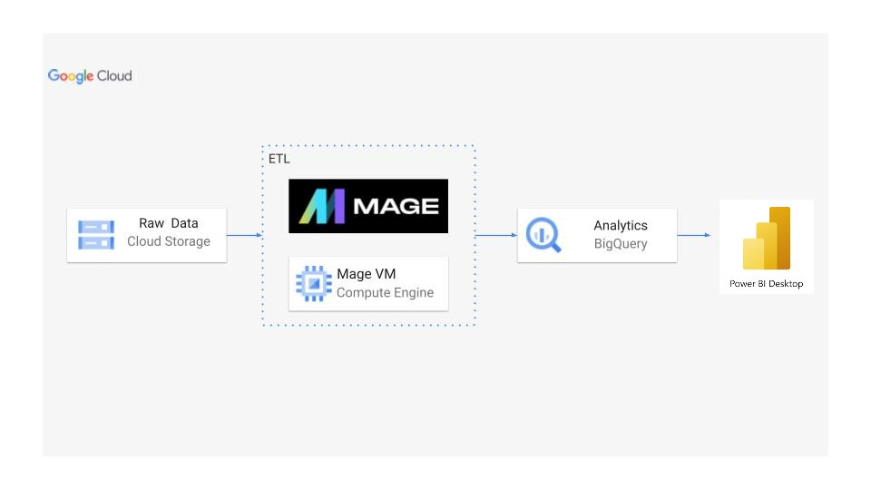
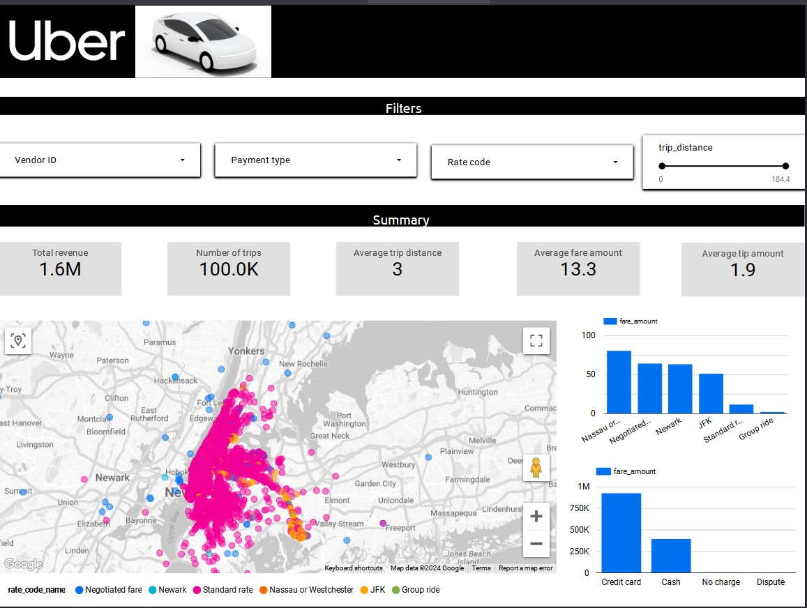

<h1> Uber data analytics project using Google cloud platform (GCP)</h1>
<h2>Learning outcomes</h2>

 The goal of this project is to perform data analytics on Uber data and to learn to use the various tools and technologies, including GCP Storage, Python, Compute Instance, Mage Data Pipeline Tool, BigQuery, and Looker Studio.

<h2>Architecture</h2>

<h2>Technologies Used</h2>
<ol>
<li>Python</li>
<li>Google Cloud Platform</li>
<ul>
<li>Google Storage</li>
<li>Compute Instance</li>
<li>BigQuery</li>
<li>Looker Studio</li>  
</ul>
 <li> Modern Data Pipeine Tool - https://www.mage.ai/</li> 
</ol>
<h2>Dataset Used</h2>

TLC Trip Record Data Yellow and green taxi trip records include fields capturing pick-up and drop-off dates/times, pick-up and drop-off locations, trip distances, itemized fares, rate types, payment types, and driver-reported passenger counts.

Here is the dataset used in the video -https://github.com/pratyush3256/Uber-Data-Analytics-Project-Using-Google-Cloud-Platform-GCP/blob/main/uber_data.csv

 More info about dataset can be found here:
<ul>
<li>Website - https://www.nyc.gov/site/tlc/about/tlc-trip-record-data.page</li>
<li>Data Dictionary - https://www.nyc.gov/assets/tlc/downloads/pdf/data_dictionary_trip_records_yellow.pdf</li>
</ul>

<h2>Data Model</h2>

<h2>Final Dashboard</h2>

